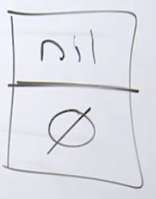
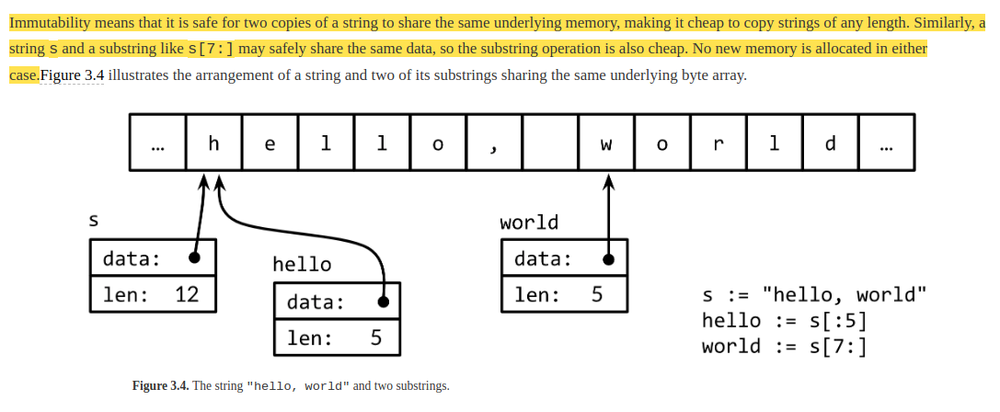
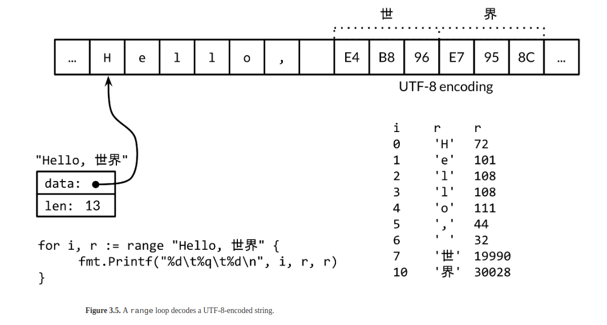

# B"H


## Key Notes

- **Type is Life!**

- **Type** provides us two pieces of information:
    1. size
    2. representation (what it represents)

- In general, just use `int` 
    - Its size will be based on the architecture that we are building for.
    - For example, on an AMD64 (a 64-bit architecture): 
        - our **pointer** size or the **address** size is gonna be 64 bits or eight bytes. 
        - Go will do the following: the generic **word size** will be 8 bytes (a Go **word** refers to a value that can change size depending on the architecture)  
        - In other words, Go says, if your address and your word size is 8 bytes, let's just make the integer follow. 
        - ... **mechanical sympathies** at its finest!. 

- **Zero Values** 
    - ... very very important - it's for integrity    
    - This is going to help with a huge number of bugs that we found in the past ... 


- Follow this rule: if you want to declare a variable and it's gonna be set to its zero value state, use `var` approach.
    - `var` gives us zero value 100% of the time
```go
var a int
var b string
var c float64 
var d bool
```

---

### Strings

- A `string` is really kind of made up datatype for any language
- Go has a unique way
- `string` is **two word data structure** (see above on meaning of **word**)
    - 1st word is a pointer
    - 2nd word is the number of bytes.

**An empty `string`**:


**`hello world`**:


**utf8 example**:



---

### Conversion

- Go doesn't have **casting**, it has **conversion**. 
- And what conversion means really is that we may be taking a cost, a memory cost, as we convert values from one type to the other. 
- What casting has done traditionally: 
    - Let's say that we allocated a one byte integer.     
    - Let's say for some silly crazy reason, I decide that I really want `a`, not to represent a one byte integer, but a four byte integer. 
    - Casting will allow me to tell the compiler, look, you know and I know that `a` is an a one byte integer, but casting let's us pretend that what that memory really is is a four byte integer, and the compiler trusting us will just say, okay, and suddenly now, if I'm casting a from one bytes to four bytes, I have the ability to read and write memory across those four bytes from this particular location. 
    - I could be potentially corrupting a lot of memory here.  
- The idea of **conversion** over **casting** is an **integrity** play. 


### Final Notes

* The purpose of all programs and all parts of those programs is to transform data from one form to the other.
* Code primarily allocates, reads and writes to memory.
* Understanding type is crucial to writing good code and understanding code.
* If you don't understand the data, you don't understand the problem.
* You understand the problem better by understanding the data.

