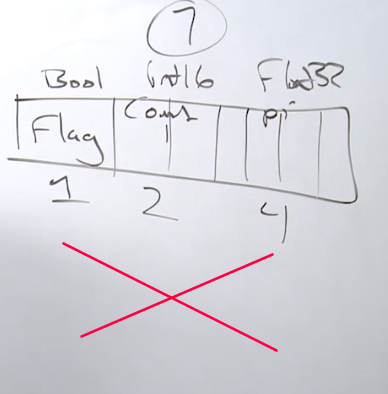
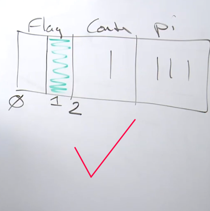

# B"H


## Struct Types

Struct types are a way of creating complex types that group fields of data together. They are a great way of organizing and sharing the different aspects of the data your program consumes.

A computer architecture’s potential performance is determined predominantly by its word length (the number of bits that can be processed per access) and, more importantly, memory size, or the number of words that it can access. 

## Notes

* We can use the struct literal form to initialize a value from a struct type.
* The dot (.) operator allows us to access individual field values.
* We can create anonymous structs.

## Quotes

_"Implicit conversion of types is the Halloween special of coding. Whoever thought of them deserves their own special hell." - Martin Thompson_

---

### Notes on following snippet.

```go
type example struct {
	flag    bool
	counter int16
	pi      float32
}

func main() {

	var e1 example

	fmt.Printf("%+v\n", e1)

	// Declare a variable of type example and init using
	// a struct literal.
	e2 := example{
		flag:    true,
		counter: 10,
		pi:      3.141592,
	}

	// Display the field values.
	fmt.Println("Flag", e2.flag)
	fmt.Println("Counter", e2.counter)
	fmt.Println("Pi", e2.pi)
}
```

See we're creating a **_value_** **of type** `example`, named `e1`, setting it to its zero value. 

**Note**, you won't hear me use the word **object** in Go. We create **values** in Go. 

Always remember we optimize for **correctness** first.

---

That being said, how much memory is allocated for `e1`?
- You might guess seven - not a bad guess - but wrong.
    


- Wrong because we have the concept of **alignments**. And they come from the hardware. Alignments are there to make reading and writing memory as efficient as possible. 

- The hardware has the ability, let's say within one instruction, to read and write one **word boundary**. 

- So, the idea around alignments is, there's no reason to allow a value to cross over word boundaries if it can fit in one. 

- Now, what that means is, is that we're going to end up with this other concept of **padding** inside of our structs. 

- Well, when you get to a 2-byte value, like `counter`, we could cross over these boundaries. So what we need to do is, make sure that any 2-byte value always aligns within a single word boundary. How do you do that? Well, you make sure that that value always falls within a 2-byte address scheme. In other words, if we look at the last digit of any address, it always falls on a multiple of two, in terms of its address. It falls within, address zero, address two, address four, address six, address eight, you get it. 

- And if we have a 4-byte value, then it has to fall on a 4-byte alignment. Address zero, address four, address eight, etc. 

- And if it's an 8-byte value, then it's gotta fall in that full boundary address zero, address eight. 

- So, what we're doing, is looking at the size of a value to determine what its alignment is, and then making sure that it falls properly in memory within those boundaries. 

- Now we can how `e1`is an 8-byte value (byte 2 is used for padding.)


    

- A struct must properly align based on its largest field.
    
- The only way padding could be a problem initially, is maybe we've got so much padding in the struct that it's allocating much more memory than we want it to. And therefore, maybe we've got a larger footprint in memory. 
    
- Now, if we truly want to micro-optimize the padding away, what we need to do is, order fields from largest to smallest. 

- But, of course, initially let's only group things together that belong together. Instead of going right into this idea of optimizing for performance.
    
---


     And you might say, "Well, Bill, why doesn't the language "do this for you?" Because the language isn't going to go behind your back and make changes, because then we would lose our ability to understand the impact that we're having. You get to control your memory layouts. You get to make them as precise as you need them to be. And it's not the language's job to go behind the back and try to pre-optimize things for you, either. There are some languages that might do that, Go isn't going to do that. So, the idea again, around understanding the size of a struct, means we have to understand alignments and padding. And now we know that, based on the size of a field, and this would be anywhere in memory. You don't really feel it until we get to the struct types. But our int16s have to fall on a 2-byte alignment. Our float32 has to fall on a 4-byte alignment. Our bools can kind of be put anywhere, and that can cause places for padding. So, we really got an 8-byte value, here. So on line 20 when we construct our e1 variable or value of type example, that's eight bytes of memory cost. Now we know that is. And I wanna show you on line 27, what line 27 is showing you, is how we do construction when we don't want zero value. And this is going to be a very common syntax in Go. We're going to call this a literal construction. So over here, you see literal construction of the name type example. We're initializing field counter in pi. You see the syntax with the colon. You also see a comma at the end of every line, Go is very much about convention over configuration. It's very opinionated here. Go funct is going to play a big role in your life here, and so, these are opinions that you have. Whether you like it or not, this is the way it's going to be. You can see, the use of the short variable declaration operator during this construction, as well. And Go is not being novel, we're going to use the dot operator, value dot field, value dot field. Now, you might see this in a lot of code in Go. You might see the use of literal construction, to create a value set to its zero value. There is nothing wrong with this. I don't do it again. Because I'd rather use var to show zero value construction, like I showed you there, on line 20. Line 27 is also doing zero value construction, in this case. But what I tried to tell you before is, just because literal construction here, literal empty construction here, as struct is creating zero value, that's not necessarily the case all the time. So I'd rather use var. But there's nothing wrong with that, if that's what you want to do. Just be consistent, but in this code that we're going to go through, we're going to use a literal construction most of the time when we want initialize to something other than zero value, 'kay? The only time you might see empty literal construction from me, is when we're not assigning it to a variable. You might see it on a return. That will be absolutely fine. You might see it on a function call. That will be the exception to empty literal construction. But anytime we're assigning it to a variable, I'm not going to do that at all. Okay. So, that's our basic, kind of, struct or layout, or user defined struct. But let's take a look at something that I think is a little bit more interesting. Go also has the concept of an anonymous struct. We'll call these literals in the language. Any time you see a compiler message about a literal value, or literal type, what we're really talking about is an unnamed type. So, there are things in this language that are named and there are things that are unnamed. What you see on line 14, is us declaring a variable name e1, based on the literal struct type. I can't give it a name because there isn't any. We're using var so again, it's set to its zero value. You know, readability is about consistency. And you can start seeing our leveraging var to have a very consistent look and feel around zero value. And you can see on line 21, I'm displaying the value of e1, which will all be set to its zero value. And here, what you're seeing, is I'm doing literal construction. Actually this is, again, type declaration, so we're declaring on the fly, a struct. It's a literal struct and has no name. And right below it, you now see the literal construction, 'cause we're not going to set it to zero value. You'll see a lot of this in Go. These literal types can come in really handy for things like, when you're doing, let's say unmarsheling on a web API. A piece adjacent might come in, you have to do some unmarsheling, you need some type information, but it's not necessarily good to name it. Because this only need to be used in this one place. And we don't want to name something we're only using in one place. That would be pollution. We get the ability to find these structs literally where they're needed and use them right then and there. It also really enhances readability since this is struct, it is leveraged the same way. Okay. Let's focus on this e2 struct here, or the e2 variable, because I want to talk about this, as well. Let me take this struct declaration that we have. And let's do something very interesting. Let's go ahead and define two types. I'm going to have type bill and let's create a type named alice. Now, I'm going to hit the format buttons so we can do this. I want you to notice something about bill and alice. They are really, technically, identical. They're identical and compatible. They have the same memory layout, the same field names, and ideally, if I have a value of type bill or alice, I should be able to assign them to each other without any integrity issues, right? There are none. Their memory layouts are identical. All right, so let's do the following then. I'm going to come back here and I'm going to create a variable of type bill. And a variable of type alice. Both set to their zero value. And I'm going to go ahead and assign alice to bill. Now the compiler will complain if I don't use these variables. And if the compiler, again, focusing or the language, again, focusing on readability. Don't declare a variable if you're not going to use it. Doesn't help with readability, so I'm just going to display it. But here's the question, we know bill and alice are identical. We know they are compatible, I do this assignment, and it shouldn't be a problem I know it, the compiler knows it. But look at what the compiler says, it says sorry, Bill, but you can't use A as type alice, as type bill in the assignment. I'm sorry, but we're not going to do this assignment. Now, there are lots of other languages that would've done this assignment. And when languages do this assignment, we call it an implicit conversion. We're going back to what Martian Thompson said about implicit conversion being like a Halloween special. Implicit conversion has caused a tremendous amount of pain for software over the decades. And, no, it's not going to cause us pain, necessarily with our struct types. Where it traditionally has caused pain, is when B is an int, a signed int. And A is an unsigned int. And the compiler allows the signed and unsigned variables to be assigned to each other. We know now there's going to be a loss of precision, and therefore, there's going to be data corruption. And so, though there are languages enterically, that have done implicit conversion when there is data that is identical and compatible, it's caused more problems than good. And Go says, look, when we're working with this concrete data, if the data is like this, bill and alice, right, we're based on these name types, I'm sorry, but I'm not going to do implicit conversion because historically it's caused more problems than good. But what if we really need to do this assignment? This is were conversion comes in. I love the idea of conversion in Go, because what it does, is it shows your intention. It's a way of telling the compiler, look, it is my intention that A does get assigned to B. And now there can't be any mistake. The compiler can't say, well, I thought you wanted to do this. No, no, no, no. Now the compiler's saying, if you really want to do this, then you explicitly, not implicitly, explicitly tell me through the conversion syntax. Show me that this was your intent. And there it is, we see conversion syntax. And now, if I do this, yes, we're going to be able to compile through. This is a beautiful, a beautiful piece of the language. Holding us in our code, to integrity and holding us to responsibility. When we're doing these types of assignments. But I've got an interesting question for you. We've got an e2 variable here, based on a struct that also is identical and compatible with bill and alice. What if I go ahead and I put e2 here? What will the compiler do? Will the compiler allow this, or still ask for conversion? Well, what your going to notice is the compiler doesn't ask for conversion here. And now, the big difference between A and e2 is that A was a name type, e2 is a literal type. When the type is named, there's going to be no implicit conversion. You're going to have to show your intent through conversion. But when the value like this, isn't named, it's a literal type, now we have this flexibility on assignment. Now again, it's kind of silly to do it with struct types. Ideally, you'll see this type of assignment with literal values, when we deal with functions. A function in Go is a value, it's a literal value. It's not a named type. And we pass functions to functions all over Go. Especially, we start talking about web APIs and middlewares and things like that. So, it makes you aware it's not really cumbersome. So I love the balance that the language is giving us here. If we're dealing with values of a name type, there is no implicit conversion. You've gotta use your conversion syntax, you've gotta show your intent. When there's, when we're dealing with that literal type value then we're gonna get a little bit more flexibility. Well, it's not really implicit there so much as we know that these things are compatible. We allow it to happen. And everything is safe. And we maintain these safe levels of integrity throughout our code. So remember that Go's not being novel here, the key word struct is our core way of defining user defined data in the language. We don't have the key word class, like you might have seen in other languages. We have struct. Struct defines that data. There's no implicit conversion when we start talking about the concrete data name types. We've got literal types. And the conversion syntax comes in handy here, when we're talking about doing that explicit conversion, okay? Then we also talked about the idea that I don't want to optimize for performance here. We always want to optimize for correctness. If I go back to the first example, you can see I want the fields to be laid out correctly. In other words, readability first. Grouping things together, but I want you to be able to understand the cost of things. And understanding how much memory's going to be allocated for a particular type helps you with understanding cost and therefore, we talked about alignments, We talked about padding. And we talked about that only unless you have a benchmark, that's showing you're using up too much memory, would I want to optimize that struct to minimize padding. I cannot stress this enough, because I've had too many clients come in after this lesson and restructure everything to reduce padding to the bottom. Please don't do that. I'm teaching you this so we can look at cost in terms of allocation. Not so we can restructure everything.