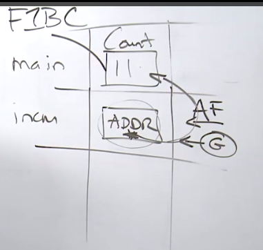
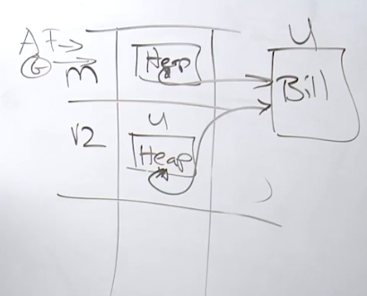
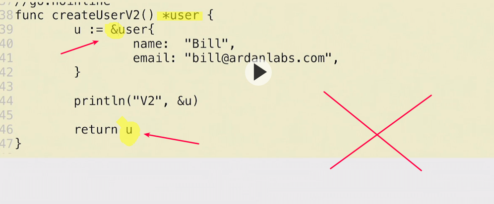
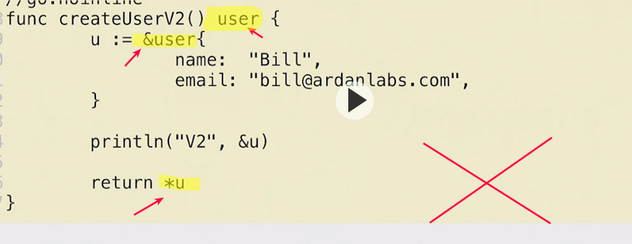
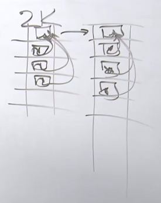

# B"H


## Pointers

Pointers provide a way to share data across program boundaries. Having the ability to share and reference data with a pointer provides the benefit of efficiency. There is only one copy of the data and everyone can see it changing. The cost is that anyone can change the data which can cause side effects in running programs.


## Escape Analysis

* When a value could be referenced after the function that constructs the value returns.
* When the compiler determines a value is too large to fit on the stack.
* When the compiler doesn’t know the size of a value at compile time.
* When a value is decoupled through the use of function or interface values.


## Stack vs Heap

_"The stack is for data that needs to persist only for the lifetime of the function that constructs it, and is reclaimed without any cost when the function exits. The heap is for data that needs to persist after the function that constructs it exits, and is reclaimed by a sometimes costly garbage collection." - Ayan George

## Links

### Pointer Mechanics

   
   
[Using Pointers In Go](https://www.ardanlabs.com/blog/2014/12/using-pointers-in-go.html) - William Kennedy    
[Understanding Pointers and Memory Allocation](https://www.ardanlabs.com/blog/2013/07/understanding-pointers-and-memory.html) - William Kennedy    


### Escape Analysis and Inlining

[Go Escape Analysis Flaws](https://docs.google.com/document/d/1CxgUBPlx9iJzkz9JWkb6tIpTe5q32QDmz8l0BouG0Cw)  
[Compiler Optimizations](https://github.com/golang/go/wiki/CompilerOptimizations)

### Garbage Collection

[The Garbage Collection Handbook](http://gchandbook.org/)  
[Tracing Garbage Collection](https://en.wikipedia.org/wiki/Tracing_garbage_collection)  
[Go Blog - 1.5 GC](https://blog.golang.org/go15gc)  
[Go GC: Solving the Latency Problem](https://www.youtube.com/watch?v=aiv1JOfMjm0&index=16&list=PL2ntRZ1ySWBf-_z-gHCOR2N156Nw930Hm)  
[Concurrent garbage collection](http://rubinius.com/2013/06/22/concurrent-garbage-collection)  
[Go 1.5 concurrent garbage collector pacing](https://docs.google.com/document/d/1wmjrocXIWTr1JxU-3EQBI6BK6KgtiFArkG47XK73xIQ/edit)  
[Eliminating Stack Re-Scanning](https://github.com/golang/proposal/blob/master/design/17503-eliminate-rescan.md)  
[Why golang garbage-collector not implement Generational and Compact gc?](https://groups.google.com/forum/m/#!topic/golang-nuts/KJiyv2mV2pU) - Ian Lance Taylor  
[Getting to Go: The Journey of Go's Garbage Collector](https://blog.golang.org/ismmkeynote) - Rick Hudson  

### Static Single Assignment Optimizations

[GopherCon 2015: Ben Johnson - Static Code Analysis Using SSA](https://www.youtube.com/watch?v=D2-gaMvWfQY)  
[package ssa](https://godoc.org/golang.org/x/tools/go/ssa)    
[Understanding Compiler Optimization](https://www.youtube.com/watch?v=FnGCDLhaxKU)

### Debugging code generation

[Debugging code generation in Go](https://rakyll.org/codegen/) - JBD    

## Code Review

[Pass by Value](example1/example1.go) ([Go Playground](https://play.golang.org/p/9kxh18hd_BT))  
[Sharing data I](example2/example2.go) ([Go Playground](https://play.golang.org/p/mJz5RINaimn))  
[Sharing data II](example3/example3.go) ([Go Playground](https://play.golang.org/p/GpmPICMGMre))  
[Escape Analysis](example4/example4.go) ([Go Playground](https://play.golang.org/p/n9HijcdZ3pT))  
[Stack grow](example5/example5.go) ([Go Playground](https://play.golang.org/p/vBKF2hXvKBb))  

### Escape Analysis Flaws

[Indirect Assignment](flaws/example1/example1_test.go)  
[Indirection Execution](flaws/example2/example2_test.go)  
[Assignment Slices Maps](flaws/example3/example3_test.go)  
[Indirection Level Interfaces](flaws/example4/example4_test.go)  
[Unknown](flaws/example5/example5_test.go)  


--- --- --- --- --- --- --- --- ---

Remember, the lack of performance is gonna come from **four** places. 
1. **Latency** around networking, disk I/O, etc. 
2. Allocations and memory, garbage collection. 
3. How we access data .
4. Algorithm efficiency. 

---

Everything in Go is **pass by value**. 
- When I say pass by value, what I mean is WYSIWYG. 

---

#### Behind the Scenes - Part 1 

Remember
- **G**: Goroutine
- **P**: Logical Processor
- **M**: OS Thread
- **C**: Core

When your Go program starts up, it's gonna be given a **`P`** or a **logical processor** for every **core** (**`C`**) that's identified on the host machine. 

That **`P`** is given a _real live_ **operating system thread** that we call **`M`**.
 
That **`M`** is going be scheduled by the operating system scheduler on a particular core.

We get one more thing from the run time, and that is our **goroutine**, our **`G`**. 

---

#### Behind the Scenes - Part 2 

**Path of Execution**

**Threads** are our **path of execution** at the **operating system** level. 

All code at some point gets into **machine code**, and the operating system's job is to choose a path of execution, a thread to execute those instructions one after the other, starting from `main`. That's the job of the thread. 

---

There's **3** areas of memory that we may talk about throughout the class. 
1. The Data Segment 
    - usually reserved for global variables and read-only values
2. Stacks
3. Heaps 

We're going focus on stacks and heaps.

---

#### Behind the Scenes - Part 3

**Stacks**

A stack is a data structure that every thread is given. 

At the operating system level, your stack is a **contiguous** block of memory and usually it's allocated to be **1MG**. 

**1MG** of memory for every stack, and therefore for every thread. 

**`G`**s are very much like **`M`**s; we could almost say that they're the same but **`G`** above the operating system. 

A **`G`** has a stack of memory; **2K** in size (a lot lot smaller than **1MG**) 


#### Behind the Scenes - Part 4

By the time the goroutine that was created for this Go program wants to execute main, it's already executed a bunch of code from the run time. 

Any time a goroutine makes a function call, what it's going to do is take some memory off the stack. We call this a frame of memory. 

Remember, every line of code we write is either reading memory or writing memory. Obviously, also allocating at some point. 

The goroutine only has **direct** access to memory for the frame that it is operating on - called the **active frame**. 

The stack frame is serving a really important purpose. It's creating a sandbox, a layer of isolation. 

#### Behind the Scenes - Part 5

**Mechanics and Semantics** 
- Mechanics: how things work. 
- Semantics: how things behave. 

---

Every time you make a **function call**, what we're really doing is crossing over a **program boundary**. 

Program boundaries are important to identify, because it means that we're gonna be moving out of this sandbox or frame and we're gonna be moving into a new one. 

Every time we call a function, what's going to happen is we're going to slice a new frame off the stack. 

This is where the idea of **parameters** comes from. Parameters are really serving a mechanical purpose on top of our design purpose, and that is to get data inside of this new frame so the goroutine can operate this new data transformation in a level of isolation with a level of immutability. 

**_Everything_** in Go is **passed by value**, what that means is that we're gonna make a **copy** of the data as it goes across the boundary. 

There's two types of data that we operate with; the **value itself** or the **value's address**. Yes, addresses are data, and I want you to always understand that. 

When you pass the **data value itself** into a parameter, this is called **value semantics**. 

When you pass the **data value's address** into a parameter, this is called **pointer semantics**. 

---

**Pointer semantics** serve one purpose and that is to share a piece of data across a **program boundary**.

What happens when you pass **data value's address**: 
- Now you might think that this is what's called a pass by reference. 
- It really isn't. 
- Remember pass by value means WYSIWYG!! 
- It just so happens that the data we are copying and passing is not a value, it's an address. 

Pointer variables are not special. They aren't, they serve one purpose, and that is to store addresses. 

---

`*inc++`
- This is what we call an **indirect** memory read or write. 
- A read/modify/write operation through pointer indirection. 



---

However, there's a huge cost to pointers. Remember now we've just walked away from our mutation isolation, our immutability. What we've done is set ourselves up for what we call **side effects** in our code. When we start mutating memory, we have to be very, very careful. 

---

Any memory below the **active frame** (**`AF`**) is not valid memory. 

---


#### Behind the Scenes - Part 6

We don't have **constructors** in Go. Yay, we don't want that - it hides cost. 

What we do have is what I call **factory functions**.
- Factory function is a function that creates a value, initializes it for use, and returns it back to the caller. This is great for readability, it doesn't hide cost, we can read it, and lends to simplicity in terms of construction. 

```go
type user struct {
	name  string
	email string
}

func main() {
	u1 := createUserV1()
	u2 := createUserV2()

	println("u1", &u1, "u2", u2)
}

/*
Factory function createUserV1
    - It returns a value of type user 
    - i.e. this function is using value semantics.
*/ 
//go:noinline
func createUserV1() user {
	u := user{
		name:  "Bill",
		email: "bill@ardanlabs.com",
	}

	println("V1", &u)

	return u
}

//look at the return, it's not using value semantics anymore. Version two is using pointer semantics.

/*
Factory function createUserV2
    - It returns an address/pointer 
    - i.e. this function is using pointer semantics.
*/ 
//go:noinline
func createUserV2() *user {
	u := user{
		name:  "Bill",
		email: "bill@ardanlabs.com",
	}

	println("V2", &u)

	return &u
}
```

Always ask yourself; what semantic is in play? This is critical.

When we we call `createUserV2()` above:
- The compiler is really really powerful. 
- The compiler is able to perform **static code analysis** 
- In this case what the compiler will do is perform what's called **escape analysis**. 
- This will determine whether a value gets to be placed on the **stack**, which is what we want, or it **escapes** to the **heap**.
- Our first priority is that a value stays on the stack. It's very very fast to leverage the stack. Also stacks are self-cleaning, which means that the garbage collector doesn't even get involved. 
- When a value **escapes** a stack and ends up on the heap, we call that an **allocation**. 



---

So memory is left alone on the stack as we go _up_ and cleaned on the way _down_, so the garbage collector doesn't have to get involved -it's self-cleaning. 

---

Anytime you mix semantics we're going to have a problem. 

So, here is a general guideline; never use **pointer semantics** during **construction** -  rather only use **value semantics** during **construction**. 

uggh:



... more uggh:



---

#### Behind the Scenes - Part 7

If the compiler doesn't know the size of a value at compile time, it must immediately construct it on the heap. 

This is because the stack frames for every function are sized at compile time. Frames are not dynamic. 

What happens when you've got a Go routine that's making lots of function calls and eventually it runs out of stack space?  

We get a new stack - very unique from a programming language

It's going to do is allocate a larger stack, 25% larger than the original one, and then copy all the frames over.

But this isn't something that's going to happen all of the time. 2K is usually more than enough for our stacks, because you usually don't go more than even like 10 function calls deep. 



---

See [example5.go](example5/example5.go) for interesting example.

---

Since a value can move in memory that's on the stack, this actually creates an interesting constraint for us in Go - no stack can have a pointer to another stack. 

Imagine, we had all of these stacks all over the place, hundreds of thousands of Go routines with pointers to each other's stacks. If a stack had to grow, we would have to track every pointer that points to this stack and update it as well. You want to talk about _stop the world_ latency, that would be insane. 

---

#### Behind the Scenes - Part 8

**Deep Dive into GC**
- Not crucial for now to remember all the nitty-gritty, but it is cool stuff
- [2.3 Pointers - Part 5 (GC)](https://learning.oreilly.com/videos/ultimate-go-programming/9780135261651/9780135261651-UGP2_01_02_03_05)
- [Garbage Collection Semantics Part I](https://www.ardanlabs.com/blog/2018/12/garbage-collection-in-go-part1-semantics.html) - William Kennedy