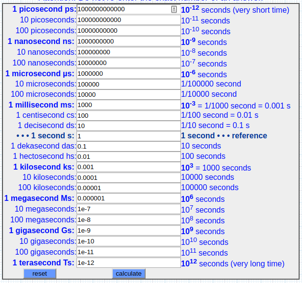
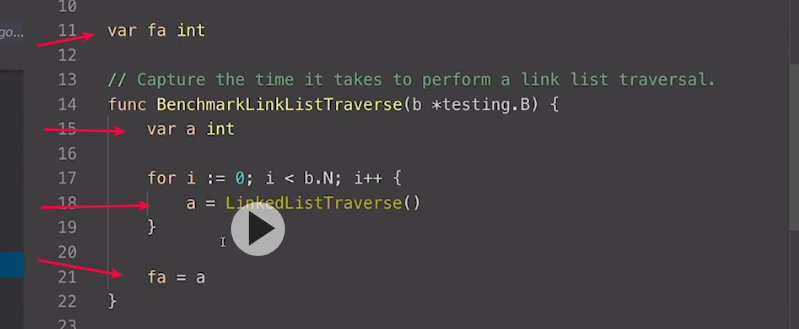

# B"H


## Arrays

Arrays are a special data structure in Go that allow us to allocate contiguous blocks of fixed size memory.

<br>

### Notes

* If you don't understand the data, you don't understand the problem.
* If you don't understand the cost of solving the problem, you can't reason about the problem.
* If you don't understand the hardware, you can't reason about the cost of solving the problem.
* Arrays are fixed length data structures that can't change.
* Arrays of different sizes are considered to be of different types.
* Memory is allocated as a contiguous block.
* Go gives you control over spacial locality.

<br>

### CPU Cache Notes

* CPU caches works by caching main memory on cache lines.
* Cache lines today are either 32 or 64 bytes wide depending on the hardware.
* Cores do not access main memory directly. They tend to only have access their local caches.
* Both data and instructions are stored in the caches.
* Cache lines are shuffled down L1->L2->L3 as new cache lines need to be stored in the caches.
* Hardware likes to traverse data and instructions linearly along cache lines.
* Main memory is built on relatively fast cheap memory. Caches are built on very fast expensive memory.

---
<br>

* Access to main memory is incredibly slow, we need the cache.
	* Accessing one byte from main memory will cause an entire cache line to be read and cached.
	* Writes to one byte in a cache line requires the entire cache line to be written.

---
<br>

* Small = Fast
	* Compact, well localized code that fits in cache is fastest.
	* Compact data structures that fit in cache are fastest.
	* Traversals touching only cached data is the fastest.

---
<br>

* Predictable access patterns matter.
	* Whenever it is practical, you want to employ a **linear array traversal**.
	* Provide regular patterns of memory access.
	* Hardware can make better predictions about required memory.

* Cache misses can result in TLB cache misses as well.
    * A translation lookaside buffer (TLB) is a memory cache that is used to reduce the time taken to access a user memory location
	* Cache of translations of a virtual address to a physical address.
	* Waiting on the OS to tell us where the memory is.

---

### Cache Hierarchies

This is a diagram showing the relationship of the cache hierarchy for the 4 Core i7-9xx processor. The caches in the diagram are not to scale. This processor has four cores and each core has two hardware threads. The hardware threads per core share the Level 1 caches. The cores have individual Level 1 and Level 2 caches. All cores for all the processor share the L3 cache.


<br>

This is subject to be different in different processors. For this content, the following is the multi-levels of cache associated with the Intel 4 Core i7-9xx processor:

### Intel i7 CPU Latencies From Video

```
3GHz(3 clock cycles/ns) * 4 instructions per cycle = 12 instructions per ns!

1 ns ............. 1 ns .............. 12 instructions  (one) 
1 µs .......... 1000 ns .......... 12,000 instructions  (thousand)
1 ms ..... 1,000,000 ns ...... 12,000,000 instructions  (million)
1 s .. 1,000,000,000 ns .. 12,000,000,000 instructions  (billion)

L1 - 64KB Cache (Per Core)
	4 cycles of latency at 1.3 ns
	Stalls for 16 instructions

L2 - 256KB Cache (Per Core)
	12 cycles of latency at 4 ns
	Stalls for 48 instructions

L3 - 8MB Cache
	40 cycles of latency at 13.3 ns
	Stalls for 160 instructions

Main Memory
	100 cycle of latency at 33.3 ns
	Stalled for 400 instructions
```

### Industry Defined Latencies

```
L1 cache reference ......................... 0.5 ns ...................  6 ins
Branch mispredict ............................ 5 ns ................... 60 ins
L2 cache reference ........................... 7 ns ................... 84 ins
Mutex lock/unlock ........................... 25 ns .................. 300 ins
Main memory reference ...................... 100 ns ................. 1200 ins           
Compress 1K bytes with Zippy ............. 3,000 ns (3 µs) ........... 36k ins
Send 2K bytes over 1 Gbps network ....... 20,000 ns (20 µs) ........  240k ins
SSD random read ........................ 150,000 ns (150 µs) ........ 1.8M ins
Read 1 MB sequentially from memory ..... 250,000 ns (250 µs) .......... 3M ins
Round trip within same datacenter ...... 500,000 ns (0.5 ms) .......... 6M ins
Read 1 MB sequentially from SSD* ..... 1,000,000 ns (1 ms) ........... 12M ins
Disk seek ........................... 10,000,000 ns (10 ms) ......... 120M ins
Read 1 MB sequentially from disk .... 20,000,000 ns (20 ms) ......... 240M ins
Send packet CA->Netherlands->CA .... 150,000,000 ns (150 ms) ........ 1.8B ins
```

---

```
                    1 second       (s)  = 
                1,000 milliseconds (ms) = 
            1,000,000 microseconds (µs) = 
        1,000,000,000 nanoseconds  (ns) = 
    1,000,000,000,000 picoseconds  (ps) = 
1,000,000,000,000,000 femtoseconds (fs)


- 1 picosecond is to one second as one second is to approximately 32,000 years.
- 1 femtosecond is to one second as one second is to about 32,000,000 years.
- 200 fs - the average chemical reaction, such as the reaction of pigments in an eye to light.
```

A 3 GHz (gigahertz) processor means that we have three **clock cycles**, or **three pumps**, every nanosecond.

We should be able, today, at least to execute about four instructions per clock cycle. 

---

[Time Calc](http://www.sengpielaudio.com/calculator-millisecond.htm)




#### CPU Caches / Memory


[A Crash Course in Modern Hardware - Video](https://www.youtube.com/watch?v=OFgxAFdxYAQ) - Cliff Click  
 
---

### Deep Dive

**Slices** are used everywhere in the standard library.
- The most important data structure.

<br>

Go only has arrays, slices, and maps. 
    - We should be using these core data structures as our first choice. 
	- When we go beyond that, it's usually more of an exception and not the rule.

---

<br>

Now, another thing you have to understand is when we run these benchmarks, the Go compiler is going to compile this code. The **compiler has the ability to throw dead code away**. 

In other words, the compiler could identify that this function doesn't mutate anything, yet it returns a value and we're not storing it. That means the compiler could say, I'm not gonna waste my time calling this function, because it has no impact on the output of this program whatsoever. So, notice that I'm performing the assignment to a local variable, and then to a global variable, so the compiler has no chance to throw this code away. You don't want this blazing fast benchmark, and you don't want it to be blazing fast because it didn't do anything. 



---
<br>

So, by default a benchmark will run for one second.

Let's increase the benchtime to three seconds:


--- 
<br>

If performance matters, well, main memory is so slow to access, it might as well not even be there. If you've gotta keep taking a 107 clock cycle hit every time you need to access data, kiss your performance goodbye. 

The total amount of "real" memory you have is the total amount of cache, and in this case, 8MB. 

If the data you're working with is small enough to fit into the caches, and small enough to stay as close to the hardware thread as possible, you're also gonna see some better performance. 

--- 
<br>


Alright now let's talk about how these caching systems work, because we'll be able to tie that back into our results. Let's say on Core 0, we have an instruction that we want to execute, and that instruction needs the letter M, right here, in the word main memory, let's pretend that this is our data, and we need the letter M for main memory to come into the caches. Now it'd be very inefficient for the caching system to just pull in one byte into this L1, so what the hardware does, is it takes all of the memory that we work with, and it breaks it up into what we call cache lines, and a cache line, historically, is 64 bytes of memory, mainframes could have cache lines that are, like, twice that, 128, I also believe you can go into CMOS and make these changes, but 64 bytes is the historical size of a cache line. So you can think of all of the memory that's laid out on that machine, right, all of our virtual memory, and from a caching system perspective, it's the cache line. So the full cache line of memory that that letter M is on, so if this is holding the word Main, well, those letters are gonna be on some cache line, there's gonna be some more bytes here, more bytes here, the entire cache line is moved from main memory and into that L1 cache, now, when we're gonna move that cache line into the L1 cache, we're gonna have to move a cache line out. Remember, everything is sharing this, your operating system, code, other applications, we're all sharing the hardware, so we're gonna have to move some cache line out. The hardware's gotta figure out what cache line we should move, maybe it decides it wants to keep the cache line close, and move it into L2, which means we've gotta move a cache line out of L2 now, completely, and there is already a copy on these Intel processors of cache lines in L3, we get some mechanical sympathies with that, maybe we take a hit a little bit as data's coming in, because we're gonna have to put this cache line on L3, and maybe L1, and move something out of L1, into L2, this is why it takes so long, right, but once that's set, we're good to go, the AMD processors, historically, have not made those extra copies in L3, and you could add the three caching hierarchies together, and maybe get a little bit more memory to work with. I know the new Skylake processor from Intel is looking at having a much larger L2 cache than L3, and so some of those things would change. But, again, from our perspective, what's important is that we want to try to reduce that 107 clock cycle bit of latency where we're taking the cache line out of main, and moving it into L1, or say, L2, at the time we need it. What we would prefer to happen is that this cache line is already in L1 or L2 before we need it, because if we can get the cache lines into the processor before we need it, we don't take the 107 clock cycle, it's close, maybe we only take the four, or the 11 clock cycle hit, and we won't even feel that, it's all staying with inside the core. This is what we're doing, so the question then becomes, how can we create a situation where the cache line can be inside L1 or L2 before we need it? This is our job, this is something now that becomes our responsibility, what we have to do is write code that creates predictable access patterns to memory if we want to be mechanically sympathetic with the hardware. If performance matters, then what we have to do is be much more efficient with how data gets in to the processor, not get the processors to run at higher clock speed. Predictable access patterns to memory is everything. Alright, so how do you create a predictable access pattern to memory? That's the next step, here is the simplest way to do it. If you allocate a contiguous block of memory, and you walk through that memory on a predictable stride, well guess what, the prefetchers, which is little software sitting inside the processor, the prefetchers can pick up on that data access, and start bringing in those cache lines way ahead of when you need them. The prefetchers are everything, and we must be sympathetic with them. Now, the cleanest and easiest way to create this predictable access pattern is to use an array, an array gives us the ability to allocate a contiguous block of memory, and when you define an array, you define it based on an element size, right, it's an array of string, it's an array of int, there's our predictable stride, every index is a predictable stride from the other. Prefetchers love arrays, the hardware loves arrays, it really is the most important data structure there is today from the hardware. And I almost don't even care what your algorithms are, an array is going to beat it. Now there are times when maybe you're dealing with data that is so large that a linear traversal isn't going to be more efficient, but overall, if you're dealing with data, small data, that array and those predictable access patterns are going to beat out performance every time on these traversals. Alright, so the array is the most important data structure as it relates to the hardware, but I need to make it clear, the array is not the most important data structure in Go. The slice is the most important data structure in Go. And this isn't cause the slice uses an array underneath, technically, slice is really a vector, and if you've watched any C++ videos over the last five years, and go to CPP Khan and look, and if you see any CPP Khan video over the last five years of talking about performance, you will hear the person on stage say, vectors, vectors, vectors, vectors, vectors, use vectors. Why, because, just like the slice, we're gonna be using arrays behind the scenes, we're gonna be doing those linear iterations, and we're gonna be creating predictable access patterns to memory that the prefetchers are going to pick up on. Brilliant stuff. Now, there's another cache in the hardware called the TLB, this cache is also very important. When we talk about how the operating system manages memory, the operating system manages memory at a granularity called a page. Now, operating system pages can vary in size, anywhere from 4K, 8K, 16K, there's even some Linux distributions that use two meg pages, and this is why. The TLB is a very special cache that the operating system is gonna be managing. And what it does is it creates a cache of virtual addresses to operating system page and physical memory locations. In other words, your program is working in virtual memory, it thinks it's got real memory, but it's not, right, it's given a full virtual memory, because the operating system gives it that level of abstraction. So when you say, go get me the value at this address, this virtual address, the TLB is there so the hardware can do a very quick lookup, "Hey, where is this virtual address "for this process physically located in RAM?" That's the TLB, now, if you're getting TLB cache misses, and remember, these are caches, these are small caches, high performing caches, but they're small, and if you're getting a TLB miss, now what has to happen is the hardware's gotta go ask the operating system, "Where is this thing?" and there has to be, like, a traversal around the operating system paging table. And if you're on a virtual machine, like a cloud environment, you know, those virtual machines also have their own paging tables. You know, a TLB miss could be really, really deadly, and so these predictable access patterns are not just helping with cache lines, they're also helping with making sure the TLB is also properly cached, so all of this access to memory is as fast as possible. Again, performance today is not about how fast we can churn that clock, how fast we can push the clock in terms of cycles per nanosecond, it's about how efficiently we can get data into the processor before we need it, so we can reduce all of the latency there is in accessing data, especially in main, and if we can even reduce more of the L3 latency, well guess what, we're better off. So, if we go back to our results now, I want you to notice something here. We should be able to understand now why we see what see. Look at row traversal. Row traversal was not only the fastest, it was also incredibly consistent, and why is that? That is because, when we start walking through the matrix row by row, we're walking it down cache line by connected cache line. That row major traversal is creating a predictable access pattern to memory, and the prefetchers are coming in and reducing all of the main memory latency cost, it's brilliant, right, we're gonna get the best performance I can get on my machine through row major traversal. But why is column traversal so slow and inconsistent? I played a small game here with the matrix, I made the matrix large enough so this element and the next element not only were not really in a predictable stride, let's say, but made sure that those two elements ended up on two different operating system pages. Yes, they were very far away from each other, and on different operating system pages. I've got a ton of problems, this is basically pure access memory, random access memory, sorry, this is basically pure random memory access, when we're doing column traversal. This is why our results were so inconsistent and so slow. Now the link list sits somewhere in between. We're probably getting cache line misses, because this data is not guaranteed to be on a predictable stride, but we're probably getting this data all on the same page. This is why, when we talk about a two meg page, if you're dealing with a system, like a database, or something that's gonna be very, very large amounts of memory in data storage, those two meg pages can come in really, really handy, because the TLB means more data on a page, and your TLB cache will be better off for it. So we're probably getting cache line misses on the link list, but we're not getting so many TLB misses, and we're falling somewhere in between, really interesting. So we're starting to now understand why it's not so much how fast we push the clock, it's about how efficient we can get data into the processor, and efficiency's all going to be around creating predictable access patterns to memory. So now when we come back and we look at what Go's given us, arrays, slices, and maps, it all starts to make sense. We don't have link lists, and stacks, and queues, and these things, because they are not mechanically sympathetic with the hardware when your model is a real machine. I will never say anything negative about Java, the JVM is an amazing piece of engineering, because it takes these mechanical sympathy issues and deals with them for you, with compacting garbage collectors, and data layouts, they are making sure that when you have your linked list access, when your object orient patterns, which are all really link list oriented, that underneath the covers, without you realizing it, they're creating predictable access patterns for you. We don't have a virtual machine here. You have the real machine, which means you are more responsible for your data layouts, you're more responsible for your traversals, but that doesn't mean you have to get overwhelmed. What it means is, if you use the slice, which is the most important data structure in Go, not the array, but the slice, if you use it for the majority of your data needs, you are inherently creating predictable access patterns to memory, you are inherently being mechanically sympathetic, and by the way, the Go map also is constantly creating data underneath it that is contiguous. Its job is to keep the data contiguous. Think about it, your stacks, contiguous memory. Your maps, underneath, contiguous memory. Your slice, a vector, contiguous memory. Predictable access patterns are everything today, this is why that processor speed can go down, and we can still get some better performance, so this is what we have to understand, we want to use the slice, and a slice of values is our first choice, until it is not reasonable or practical to do so. And it may not be reasonable or practical because the problem you have in front of you may be easier to solve, simpler to solve, maybe, with a binary tree or a link list, and I'd rather you say to me, "Bill, I'm not using the slice, "because if I use this other data structure, "my life and the algorithms, everybody's life around us, "is going to be better, this is easier to maintain." And I'm going to say, "You know what, "that is worth the small performance hit we'll take." Cause you've already seen, over and over again, if you've been following from the beginning, that we take integrity, we take integrity first, right, which means we're gonna take some performance hits, we gotta, like zero value, we care about memory resources being low first, that's gonna take us some performance hits, so again, what we're trying to do here is maintain mechanical sympathies until it's not reasonable or practical to do so, and this is why Go's just given us the array, the slice, and the map.