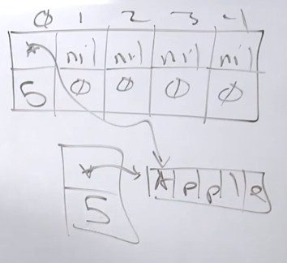

# B"H


## Arrays

Arrays are a special data structure in Go that allow us to allocate contiguous blocks of fixed size memory.

<br>

### Notes

* If you don't understand the data, you don't understand the problem.
* If you don't understand the cost of solving the problem, you can't reason about the problem.
* If you don't understand the hardware, you can't reason about the cost of solving the problem.
* Arrays are fixed length data structures that can't change.
* Arrays of different sizes are considered to be of different types.
* Memory is allocated as a contiguous block.
* Go gives you control over spacial locality.

<br>

### CPU Cache Notes

* CPU caches works by caching main memory on cache lines.
* Cache lines today are either 32 or 64 bytes wide depending on the hardware.
* Cores do not access main memory directly. They tend to only have access their local caches.
* Both data and instructions are stored in the caches.
* Cache lines are shuffled down L1->L2->L3 as new cache lines need to be stored in the caches.
* Hardware likes to traverse data and instructions linearly along cache lines.
* Main memory is built on relatively fast cheap memory. Caches are built on very fast expensive memory.

---
<br>

* Access to main memory is incredibly slow, we need the cache.
	* Accessing one byte from main memory will cause an entire cache line to be read and cached.
	* Writes to one byte in a cache line requires the entire cache line to be written.

---
<br>

* Small = Fast
	* Compact, well localized code that fits in cache is fastest.
	* Compact data structures that fit in cache are fastest.
	* Traversals touching only cached data is the fastest.

---
<br>

* Predictable access patterns matter.
	* Whenever it is practical, you want to employ a **linear array traversal**.
	* Provide regular patterns of memory access.
	* Hardware can make better predictions about required memory.

* Cache misses can result in TLB cache misses as well.
    * A translation lookaside buffer (TLB) is a memory cache that is used to reduce the time taken to access a user memory location
	* Cache of translations of a virtual address to a physical address.
	* Waiting on the OS to tell us where the memory is.

---

### Cache Hierarchies

This is a diagram showing the relationship of the cache hierarchy for the 4 Core i7-9xx processor. The caches in the diagram are not to scale. This processor has four cores and each core has two hardware threads. The hardware threads per core share the Level 1 caches. The cores have individual Level 1 and Level 2 caches. All cores for all the processor share the L3 cache.


<br>

This is subject to be different in different processors. For this content, the following is the multi-levels of cache associated with the Intel 4 Core i7-9xx processor:

### Intel i7 CPU Latencies From Video

```
3GHz(3 clock cycles/ns) * 4 instructions per cycle = 12 instructions per ns!

1 ns ............. 1 ns .............. 12 instructions  (one) 
1 µs .......... 1000 ns .......... 12,000 instructions  (thousand)
1 ms ..... 1,000,000 ns ...... 12,000,000 instructions  (million)
1 s .. 1,000,000,000 ns .. 12,000,000,000 instructions  (billion)

L1 - 64KB Cache (Per Core)
	4 cycles of latency at 1.3 ns
	Stalls for 16 instructions

L2 - 256KB Cache (Per Core)
	12 cycles of latency at 4 ns
	Stalls for 48 instructions

L3 - 8MB Cache
	40 cycles of latency at 13.3 ns
	Stalls for 160 instructions

Main Memory
	100 cycle of latency at 33.3 ns
	Stalled for 400 instructions
```

### Industry Defined Latencies

```
L1 cache reference ......................... 0.5 ns ...................  6 ins
Branch mispredict ............................ 5 ns ................... 60 ins
L2 cache reference ........................... 7 ns ................... 84 ins
Mutex lock/unlock ........................... 25 ns .................. 300 ins
Main memory reference ...................... 100 ns ................. 1200 ins           
Compress 1K bytes with Zippy ............. 3,000 ns (3 µs) ........... 36k ins
Send 2K bytes over 1 Gbps network ....... 20,000 ns (20 µs) ........  240k ins
SSD random read ........................ 150,000 ns (150 µs) ........ 1.8M ins
Read 1 MB sequentially from memory ..... 250,000 ns (250 µs) .......... 3M ins
Round trip within same datacenter ...... 500,000 ns (0.5 ms) .......... 6M ins
Read 1 MB sequentially from SSD* ..... 1,000,000 ns (1 ms) ........... 12M ins
Disk seek ........................... 10,000,000 ns (10 ms) ......... 120M ins
Read 1 MB sequentially from disk .... 20,000,000 ns (20 ms) ......... 240M ins
Send packet CA->Netherlands->CA .... 150,000,000 ns (150 ms) ........ 1.8B ins
```

---

```
                    1 second       (s)  = 
                1,000 milliseconds (ms) = 
            1,000,000 microseconds (µs) = 
        1,000,000,000 nanoseconds  (ns) = 
    1,000,000,000,000 picoseconds  (ps) = 
1,000,000,000,000,000 femtoseconds (fs)


- 1 picosecond is to one second as one second is to approximately 32,000 years.
- 1 femtosecond is to one second as one second is to about 32,000,000 years.
- 200 fs - the average chemical reaction, such as the reaction of pigments in an eye to light.
```

A 3 GHz (gigahertz) processor means that we have three **clock cycles**, or **three pumps**, every nanosecond.

We should be able, today, at least to execute about four instructions per clock cycle. 

---

[Time Calc](http://www.sengpielaudio.com/calculator-millisecond.htm)


#### CPU Caches / Memory


[A Crash Course in Modern Hardware - Video](https://www.youtube.com/watch?v=OFgxAFdxYAQ) - Cliff Click  
 
---

### Deep Dive

**Slices** are used everywhere in the standard library.
- The most important data structure.

<br>

Go only has arrays, slices, and maps. 
    - We should be using these core data structures as our first choice. 
	- When we go beyond that, it's usually more of an exception and not the rule.

---

<br>

Now, another thing you have to understand is when we run these benchmarks, the Go compiler is going to compile this code. The **compiler has the ability to throw dead code away**. 

In other words, the compiler could identify that this function doesn't mutate anything, yet it returns a value and we're not storing it. That means the compiler could say, I'm not gonna waste my time calling this function, because it has no impact on the output of this program whatsoever. So, notice that I'm performing the assignment to a local variable, and then to a global variable, so the compiler has no chance to throw this code away. You don't want this blazing fast benchmark, and you don't want it to be blazing fast because it didn't do anything. 


---
<br>

So, by default a benchmark will run for one second.

Let's increase the benchtime to three seconds:


--- 
<br>

If performance matters, well, main memory is so slow to access, it might as well not even be there. If you've gotta keep taking a 107 clock cycle hit every time you need to access data, kiss your performance goodbye. 

The total amount of "real" memory you have is the total amount of cache, and in this case, 8MB. 

If the data you're working with is small enough to fit into the caches, and small enough to stay as close to the hardware thread as possible, you're also gonna see some better performance. 

--- 
<br>

Alright now let's talk about how these caching systems work. 

Let's say on Core 0, we have an instruction that we want to execute, and that instruction needs the letter M etc. which is in main memory. 

Now it'd be very inefficient for the caching system to just pull in one byte into this L1, so what the hardware does, is it takes all of the memory that we work with, and it breaks it up into what we call **cache lines**, and a cache line, historically, is **64 bytes** of memory. 

The entire cache line is moved from main memory and into that L1 cache, now, when we're gonna move that cache line into the L1 cache, we're gonna have to move a cache line out. Remember, everything is sharing this, your operating system, code, other applications, we're all sharing the hardware, so we're gonna have to move some cache line out. 

--- 
<br>

What's important is that we want to try to reduce that **107 clock cycle** bit of latency where we're taking the cache line out of main memory, and moving it into L1 at the time we need it. 

What we would prefer to happen is that this cache line is already in L1 or L2 before we need it.

So the question then becomes, **how can we create a situation where the cache line can be inside L1 or L2 before we need it**? 
- **Predictable access patterns** to memory is everything. 

Here is the simplest way to do it. If you allocate a **contiguous block of memory**, and you walk through that memory on a predictable stride, well guess what, the **prefetchers**, which is **little software sitting inside the processor**, the prefetchers can pick up on that data access, and start bringing in those cache lines way ahead of when you need them. The prefetchers are everything, and we must be sympathetic with them. 

Now, the cleanest and easiest way to create this predictable access pattern is to use an array, an array gives us the ability to allocate a contiguous block of memory, and when you define an array, you define it based on an element size, right, it's an array of string, it's an array of int, there's our **predictable stride**, every index is a predictable stride from the other. 

**Prefetchers love arrays, the hardware loves arrays**, it really is the most important data structure there is today from the hardware. And I almost don't even care what your algorithms are, an array is going to beat it. 

--- 
<br>

Alright, so the array is the most important data structure as it relates to the hardware, but I need to make it clear, the array is not the most important data structure in Go. **The slice is the most important data structure in Go**. 

And this is cause the slice uses an array underneath...

--- 
<br>


Now, there's another cache in the hardware called the TLB, this cache is also very important. 

When we talk about how the operating system manages memory, the **operating system manages memory at a granularity called a page**. 

Now, operating system pages can vary in size, anywhere from 4K, 8K, 16K, there's even some Linux distributions that use two MB pages.

The TLB is a very special cache that the operating system is gonna be managing. And what it does is it creates a cache of virtual addresses to operating system page and physical memory locations. In other words, your program is working in virtual memory, it thinks it's got real memory, but it's not, right, it's given a full virtual memory, because the operating system gives it that level of abstraction. So when you say, go get me the value at this address, this virtual address, the TLB is there so the hardware can do a very quick lookup, "Hey, where is this virtual address "for this process physically located in RAM?" That's the TLB, now, if you're getting TLB cache misses, and remember, these are caches, these are small caches, high performing caches, but they're small, and if you're getting a TLB miss, now what has to happen is the hardware's gotta go ask the operating system, "Where is this thing?" and there has to be, like, a traversal around the operating system paging table. And if you're on a virtual machine, like a cloud environment, you know, those virtual machines also have their own paging tables. You know, a TLB miss could be really, really deadly, and **so these predictable access patterns are not just helping with cache lines, they're also helping with making sure the TLB is also properly cached, so all of this access to memory is as fast as possible**. 

--- 
<br>

If you use the slice, which is the most important data structure in Go, not the array, but the slice, if you use it for the majority of your data needs, you are inherently creating predictable access patterns to memory, you are inherently being mechanically sympathetic. 

**The Go map also is constantly creating data underneath it that is contiguous**. Its job is to keep the data contiguous. 

--- 
<br>


Think about it, your stacks, contiguous memory. Your maps, underneath, contiguous memory. Your slice, a vector, contiguous memory. Predictable access patterns are everything today, this is why that processor speed can go down, and we can still get some better performance. 

---

## 3.2 Arrays—Part 2 (Semantics)

```go
var fruits [5]string
fruits[0] = "Apple"
```



<br>
---

Go only uses a `for` statement for all of its iteration. 

The `for range` is a very special and powerful iterator in Go. The reason why it's so powerful is because the `for range` comes with two different semantics. 
- There are **value semantics** and **pointer semantics** associated with the `for range`. 

```go
// Iterate over the array of strings. For-range using value semantics.
for i, fruit := range fruits {
	fmt.Println(i, fruit)
}
```
- On every iteration, we're gonna get the index position, zero, one, two, three, four. 
- The local variable `fruit` in the `for` loop is going to be a **copy** of every value that we're iterating over. 
- Nothing here is on the heap because it's a literal string. But let's say it wasn't a literal string. Let's say that this string was created dynamically. The only thing that would have to be on the heap is the actual string bytes. Everything else (all the `string` variables and their copies that point to those same bytes) can stay on our stack. **The string value is designed to be leveraging value semantics, it's designed to be copied**. 

<br>
---

Open [Value and pointer semantics using for-range](example4/example4.go)


<br>
---

This is not anything that I'm making up. The value and the pointer semantics are very real. 

The data drives the semantic, and whatever semantic we're supposed to use for the data, we have to be consistent and clean throughout our code base. 

I'm gonna be stressing over and over and over again that **we do not want to be mixing semantics**. 

We're gonna look at our data, we're gonna understand our data, we're gonna choose our data semantic, and then all of the code we write will follow and respect the semantic. 
