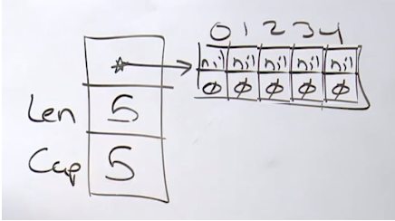
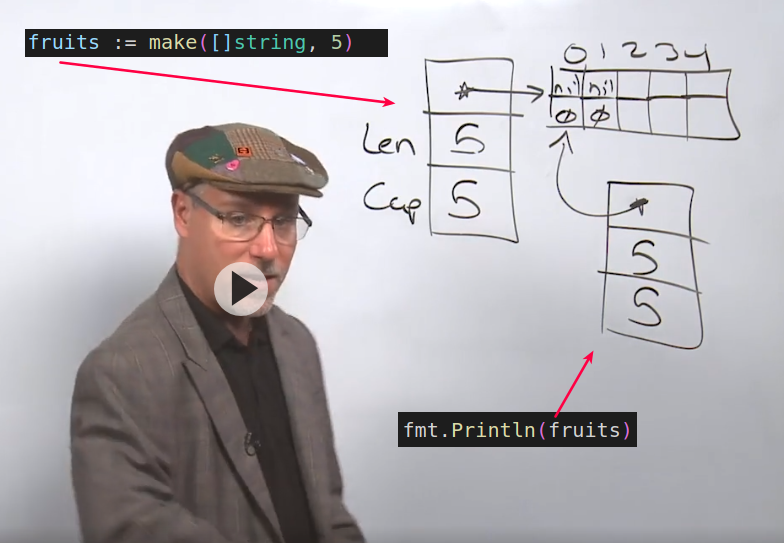
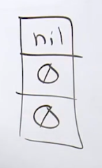
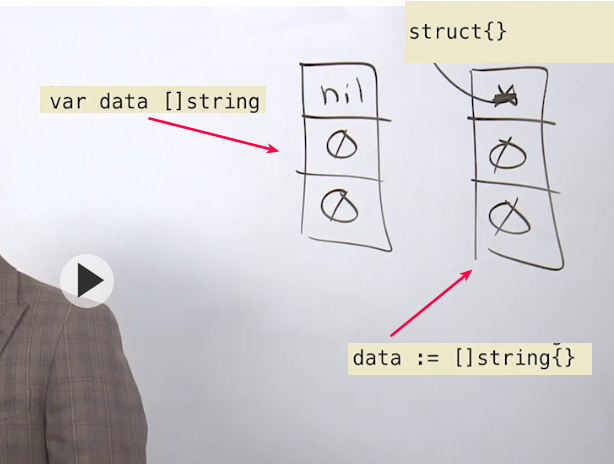
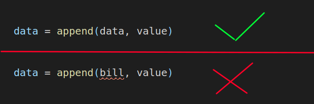

# B''H 


### Notes

* Slices are like dynamic arrays with special and built-in functionality.
* There is a difference between a slices length and capacity and they each service a purpose.
* Slices allow for multiple "views" of the same underlying array.
* Slices can grow through the use of the built-in function append.

### Links

[Go Slices: usage and internals](https://blog.golang.org/go-slices-usage-and-internals) - Andrew Gerrand    
[Strings, bytes, runes and characters in Go](https://blog.golang.org/strings) - Rob Pike    
[Arrays, slices (and strings): The mechanics of 'append'](https://blog.golang.org/slices) - Rob Pike    
[Understanding Slices in Go Programming](https://www.ardanlabs.com/blog/2013/08/understanding-slices-in-go-programming.html) - William Kennedy    
[Collections Of Unknown Length in Go](https://www.ardanlabs.com/blog/2013/08/collections-of-unknown-length-in-go.html) - William Kennedy    
[Iterating Over Slices In Go](https://www.ardanlabs.com/blog/2013/09/iterating-over-slices-in-go.html) - William Kennedy    
[Slices of Slices of Slices in Go](https://www.ardanlabs.com/blog/2013/09/slices-of-slices-of-slices-in-go.html) - William Kennedy    
[Three-Index Slices in Go 1.2](https://www.ardanlabs.com/blog/2013/12/three-index-slices-in-go-12.html) - William Kennedy    
[SliceTricks](https://github.com/golang/go/wiki/SliceTricks)    

### Code Examples

[Declare and Length](example1/example1.go) 
[Reference Types](example2/example2.go) 
[Appending slices](example4/example4.go) 
[Taking slices of slices](example3/example3.go) 
[Slices and References](example5/example5.go) 
[Strings and slices](example6/example6.go) 
[Variadic functions](example7/example7.go) 
[Range mechanics](example8/example8.go) 
[Three index slicing](advanced/example1/example1.go) 


<br>
---

### 3.3 Slices—Part 1 (Declare and Length and Reference Types)

**Slices** - this is something that you must learn, **you must master**, you can't cheat on because all of the data you'll be working with or at least the majority of it should be and probably will be stored in slices. This is your go-to data structure. 

<br>
---

##### `make` function 

It allows us to create **3** of the **reference types** that are also built into the language: 
- slice
- map
- channel
- interface values 
- functions


They're reference types because they are data structures that have a **pointer**. They're also reference types because when any of these types are set to their **zero value**, they're considered to be **`nil`** in this language. 

**A string is actually very close to being a reference type**. The problem is that when a string is set to its zero value, **it's not `nil`, it's empty** so I can't really put it in that class. 

---
<br>

For a slice, we're gonna use `make` when we already know ahead of time how much memory to allocate towards its backing data structure which is an array. 

```go
fruits := make([]string, 5)
```



A slice is a **three word** or 24 byte data structure on our AMD64 architectures and it's very similar to the string where you get a pointer and you have the length of bytes. In this case not bytes though, but the length here of five which means we're gonna have five strings. 

And when the length is only set on the make call, then the capacity matches the length. 

---
<br>

**The slice value just like the string is designed to be using value semantics.** As we're gonna learn our built in reference types are designed around value semantics. They're designed to be kept on the stack. 




I don't wanna see you sharing (with pointers) the slice value. It is designed to stay on your stack, it's designed to be using value semantics and we should be making copies of it. 

---
<br>

### 3.3 Slices—Part 2 (Appending Slices)

There's **two** things that we do with slices **all the time** in Go code. 
1. We append values to them 
2. We take slices of them 

---
<br>

We call a slice that is set to its zero value a **`nil` slice**:




When it comes to any reference type, any time it is set to its zero value, we consider it to be `nil`.

---
<br>

Note, an empty literal for the slice will **not** give you a zero value; it creates what is called an **empty slice**. 

Though the length and capacity are zero we still do have a pointer. 

Now we need this semantic because imagine that you made a database call and the call completed. It wasn't an error, but it didn't bring back any data. I mean that's not really an error. It just means that the query had an empty result, empty. So, this concept of empty is a really important semantic when it comes to collections, and this is what Go is giving us. 

Where is it pointing to? There's another special type in Go. It's called the empty struct `struct{}`. What's interesting about the empty struct is that it's a **zero allocation type**. I can create a million values of this empty struct, and there would be zero allocation. And that's because there's eight-byte value tied inside the run time, like a global variable, that this empty struct is referencing. It means all million empty struct values would have the same address. 

Really cool stuff. 




---
<br>

The API for `append` is using **value semantics**. 
- I love `append` because `append` is what we call a **value semantic mutation API**. 
- Notice that `append` does mutate, but we're not using pointers, we're not sharing. 
- `append` gets its own copy of the slice value, mutates it and returns it back. 
- This is critical. 
- `append` is able to do mutations and isolation without causing side effects because it's leveraging a value semantic mutation API. 
- Plus, I told you, slices should be using value semantics. 


---
<br>

One of the places where you could have a memory leak is on an `append` call. 
- Always confirm that the slice value being copied is the same exact one that we're gonna replace on a return. 
- If not, that would be very, very scary, because this could be potentially meaning that we could be holding a reference to old backing arrays needlessly. 
- This is really, really important. 




<br>
---

### 3.3 Slices—Part 3 (Taking Slices of Slices)

All right, now let's really learn why slices are called slices and the efficiencies we're gonna get of using pointers. This is really important stuff. Again, slices are your most important data structure when you're coding in Go. So let's start off right here. We're gonna make a slice of strings again and we're gonna start with a length of five and a capacity of eight, and this backing array is going to have that capacity of eight. We're gonna point to it and we're gonna have apple, orange, banana, grape, and plum. Apple, orange, banana, grape, and plum, and you could see here, we've got the three extra elements of capacity. Remember length is what we are allowed to access, that's these five elements here. Capacity is there for future growth and I'm using my inspect slice function that we were looking at before. Now I'm gonna add some extra print lines here. So I can just look at the output of this very first slice and you could see here, length five, capacity, eight. We have a contiguous block of memory underneath. Apple, orange, banana, grape, plum, 08 08 08 08, all eight together. Okay, great, so we've got that in place. Now one of the important things about a slice is the efficiencies that come with it as it relates to the data we're working with and what you want to see here on line 24 is our slicing syntax. What you can do is take any existing slice value, like we have here, and create a new slice value sharing the backing array for efficiency. The idea again, is the only thing that has to be on the heap is the backing array. If anything has to be on the heap, if it has to escape, the only thing that should ever escape is the backing array, the thing being shared. Our slice values get to stay on our stack, so what this syntax is saying is take your slice and what we're going to do is say a,b, and what that a,b means is index a through index b, a through b. Now the first value is very, very it's intuitive, two, index two and what that is saying is let's create a new slice value where the pointer is gonna point at index two of slice one. Okay, we get that, that's no problem there. That should mean now that we're gonna be basically starting here as it relates to this new slice, which also now means that, that's going to be index zero of this second slice, but the b values a little bit more complex. I wish it wasn't, but it is and what this syntax really means is it means go index a through b, but not including b. Other words, indexes two through four, not including four. Now when we say not including four, then what we're saying is, is that we want a length of two, because our length is only going to be able to access indexes two through four, not including four, but our capacity is always gonna be the total number of elements from that pointer position, which is one, two, three, four, five, six. So here we are, we have six elements on the capacity side, two elements on the length. Now I hate this idea of two through four, not including four, it's too complex. What I like to tell people is, if you don't know your length you shouldn't be slicing. Your length is everything when it comes to slicing. So what I like to do, is think of the slice like this. Let's start at index a, or two, but then let's do a plus whatever length you want and if you always slice with the idea of length, guess what, you'll never, ever make a mistake and that's what we did here. We said start at index two, I want a length of two, so two plus two is four. There we are. We've got our new slice and now what's very brilliant about this, is if I run this code, what we see is the original slice at a length of five and a capacity of eight. There it is, working through apple through plum, but our new slice value is only a length of two, capacity of six. Notice that when we range over the slice, we're only ranging over it's length, but also notice that bandanna and grape in both slices have the same exact address. Look, that really shows you that we are sharing this backing array and we're sharing it efficiently. This is the only cache line that has to be cached by the core that's working with these two different slices. These slice values are like a view, a unique view of the core data structure, the larger structure here that we're gonna be sharing when we have that, but I told you that pointers are dangerous, sharing is dangerous, pointer semantics can be dangerous, because of side effects and I want to show you some of these side effects right now. Look at what I do on line 30. On line 30 I take slice two and index zero. Notice something, banana can be accessed in two different ways, index two on slice one, or index zero on slice two. This is very, very dangerous. I got two different ways to come in and do this mutation and I use slice two, index zero, and I come in and I change this out. Here's that concept of a side effect, right. Let me put those print statements back in here and now let me after we make this mutation on line 30, let me display the value of both slices and what you're gonna see is that both slices see the change. We see it in index two on slice one. We see it in index zero on slice two. This is really the beginnings of a nasty side effect. What if we didn't want slice one to see this change. What if we wanted to isolate this change just as slice two. At this moment we can't 'cause we're sharing the backing array looking for those efficiencies. All right, let's put this back for a second and let's try something else. Let's go ahead, and instead of going right into that index position and making that change, why don't we try to use the append call. So in other words, I'm gonna come in here, and I'm gonna say, let's use append and we'll append it to slice two. Now what kind of behavior should we see when we use append? Maybe life will get better for us. I don't know, let's take a look. So we go ahead here and we say, let's append the new value to slice two. So append gets a copy of the slice value, says is length and capacity the same? The answer is no, brilliant, we can add to the length 'cause we have the capacity, but what's gonna happen now is append is going to bring in this element right here. It's gonna bring that element in and when it brings this element in right here, right, here its is, it brings it in. This will now be index two. Well what happens? Well, since we brought that index in, we now have to go ahead and replace the value that's there, and we will, and we'll replace it with change. Look, we just replaced plum out for change. Who's going to see that change? Guess what? Everybody see's it again. We didn't really fix our problem. We didn't get rid of our side effect. All we did was move it two indexes down, because the append brought in a element that was already in use by slice one. This is really scary, nasty stuff, but let me ask you a question for a second. Let's put this back again, the way it was. Let's pull this out, all right, we'll pull this out again, we're gonna pull all that back out. We're gonna make that plum again, and let me ask you a question. The whole problem with append was that our length and the capacity were not the same, but what if length and capacity could be the same when we make the slice? What if this could be two and two? I mean, if we, during the slicing operation, could add a third value and say let's not just adjust the length of this new slice, let's also adjust the capacity to also be two, a through, right, a through b, not including b, and a through c, not including c. If we could adjust the length and the capacity to be the same what would append do? Well append would say do I have any extra capacity and the and the answer would be no, and append would basically give us a copy on write. Look at what happens when I run this code. Notice now that we don't have a length of tow and a capacity of six, we have a capacity of two. We're still sharing the same backing array, but now after the append, look at the addresses for banana and grape, they're different. On this call to append, we've made a copy of just the elements that we were working with and we're good. Copy on write, we just got rid of the side effects because of the three index slice. Three index slices are fantastic to help reduce side effects when you know you're gonna be doing appends on a second slice value and you don't want those mutations to effect the original or other slice values that are sharing the backing array. Very cool stuff, but there also may be times where you have to maybe, manually do your own copies. Try to avoid these, but sometimes you have to do it and that's why Go gives you the built in function copy, and the built in function copy will let you take the source of one slice and make it the destination of the other. You could see here that I'm making a slice of the same length as our slice one. I'm using slice one as a source. Slice three is the destination and you'll see that slice one and slice three have different memory addresses when we do this because they're really, at the end of the day, this is going to have it's own memory address slice three, because we've manually did the copy as apposed to using the three index slice. So you're starting to see how pointers give us levels of efficiency, right. Sharing means that this data's not duplicated, which means the hardware only has to worry about copying this one thing. We get to reuse it, we get to create different views, but you can also see that, now that we're sharing data we have different ways of getting to it and therefore different ways to mutate it, and now we've got to become careful about when we're mutating and we're not mutating behind someones back to the point where they didn't expect it, and now they're gonna have problems with the data.